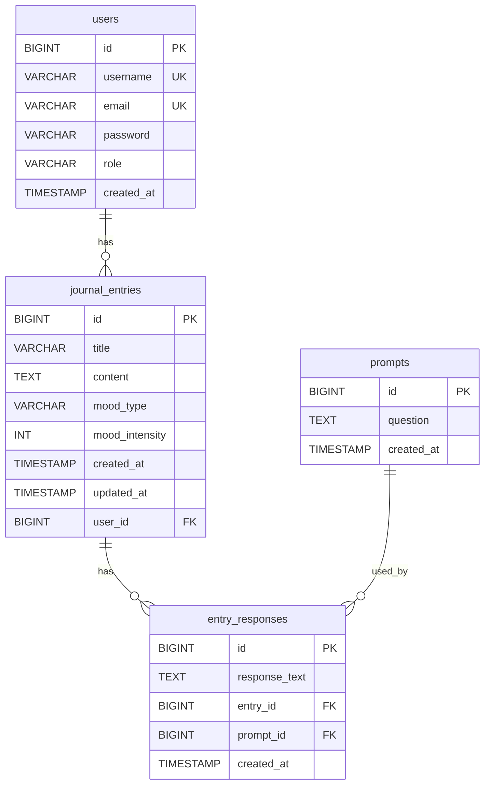

# Capstone Database ERD

This Mermaid ERD matches the current SQL schema in `schema.sql`.

## Key Mapping

- `users.id` is the primary key for `users`.
- `journal_entries.id` is the primary key for `journal_entries`.
- `prompts.id` is the primary key for `prompts`.
- `entry_responses.id` is the primary key for `entry_responses`.
- `journal_entries.user_id` is a foreign key to `users.id`.
- `entry_responses.entry_id` is a foreign key to `journal_entries.id`.
- `entry_responses.prompt_id` is a foreign key to `prompts.id`.

## Indexes

- `idx_journal_entries_user_id` on `journal_entries(user_id)`
- `idx_journal_entries_mood_type` on `journal_entries(mood_type)`
- `idx_entry_responses_entry_id` on `entry_responses(entry_id)`
- `idx_entry_responses_prompt_id` on `entry_responses(prompt_id)`
